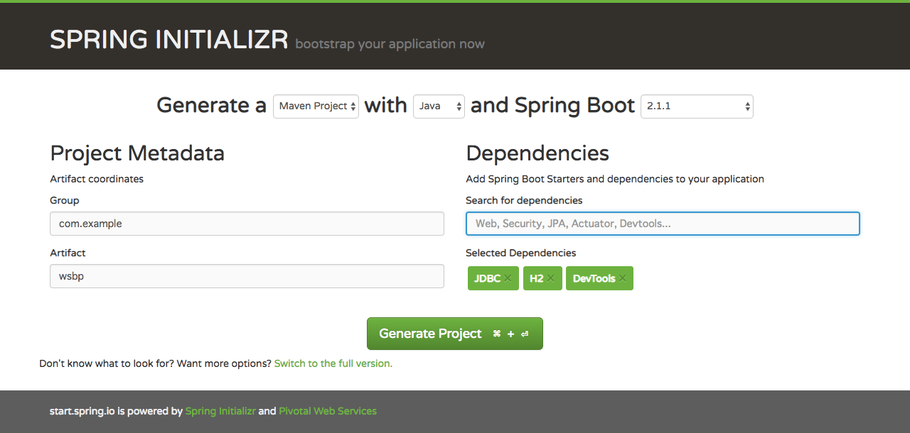

# 開発練習の準備

## Srping Boot のプロジェクトを作成する

[Spring Initializr](https://start.spring.io/) アクセスする。


- Generate a `Maven Project` with `Java` and Spring Boot の部分を `2.1.1` にする
- Artifact　を　`wsbp` にする
- Search for dependencies に `JDBC` を入力し、 `JDBC Databases` を選択（Spring JDBCを組み込む）
- Search for dependencies に `h2` を入力し、　`H2 Database (with embedded...)` を選択（H2DBを組み込む）
- Search for dependencies に `devtools` を入力し、　`Spring Boot Development Tools` を選択（Spring DevToolsを組み込む）



**Generate Project** ボタンを押して、 wsbp.zip ファイルをダウンロードする。

ダウンロードした wsbp.zip は展開する。

## IDEでプロジェクトを読み込む
  
- IntelliJ IDEA
    - import project で、wsbp.zip を展開したフォルダ内の pom.xml を選択
    - import Maven projects automatically(Mavenプロジェクトを自動的にインポートする) にチェックして続行

## pom.xmlファイルを編集する

Spring Boot には標準で Wicket は組み込まれない。

これを組み込むためには、[MarcGiffing/wicket-spring-boot](https://github.com/MarcGiffing/wicket-spring-boot) を用いる。

生成したSpring Bootプロジェクトは、 Maven というプロジェクト管理ツールで作られる。

Mavenの設定ファイル **pom.xml** が、 IntelliJ に読み込んだwsbpプロジェクトにも存在しているので、これを変更する。変更する箇所が多いので注意。

変更ミスがあると、うまく動かない原因になるので、スペルミスなどが怖い時はコピペ推奨。

### 1 `<parent>...</parent>` を書き換える

書き換え前

```xml
<parent>
  <groupId>org.springframework.boot</groupId>
  <artifactId>spring-boot-starter-parent</artifactId>
  <version>2.1.1.RELEASE</version>
  <relativePath/> <!-- lookup parent from repository -->
</parent>
```

書き換え後

```xml
<!-- Wicket-Spring-Bootの親ファイルを読み込む -->
<parent>
  <groupId>com.giffing.wicket.spring.boot.starter</groupId>
  <artifactId>wicket-spring-boot-starter-parent</artifactId>
  <version>2.1.5</version>
  <relativePath/> <!-- lookup parent from repository -->
</parent>
```

### 2 `<version>...</version>` を削除し、 `<packaging>...</packaging>` を書き換える

書き換え前

```xml
<groupId>com.example</groupId>
<artifactId>wsbp</artifactId>
<version>0.0.1-SNAPSHOT</version>
<packaging>jar</packaging>
<name>wsbp2</name>
```

書き換え後

```xml
<groupId>com.example</groupId>
<artifactId>wsbp</artifactId>
<packaging>war</packaging>
<name>wsbp</name>
```

- ここの **`<version>0.0.1-SNAPSHOT</version>` を削除する**ことに注意！


### 3 `<properties>...</properties>` を書き換える

書き換え前

```xml
<properties>
  <java.version>1.8</java.version>
</properties>
```

書き換え後

```xml
<properties>
  <java.version>1.8</java.version>
  <!-- プロジェクトでは基本的にUTF-8を使う -->
  <project.build.sourceEncoding>UTF-8</project.build.sourceEncoding>
  <project.reporting.outputEncoding>UTF-8</project.reporting.outputEncoding>
  <!-- 実行形式ファイル名につける日時の形式を年月日-時分秒に指定する -->
  <maven.build.timestamp.format>yyyyMMdd-HHmmss</maven.build.timestamp.format>
</properties>
```

### 3 `<dependencies>...</dependencies>` を書き換える

書き換え前

```xml
<dependencies>
  <dependency>
    <groupId>org.springframework.boot</groupId>
    <artifactId>spring-boot-starter-jdbc</artifactId>
  </dependency>　　

  <!-- 以下省略 -->

</dependencies>
```

書き換え後

```xml
<dependencies>
  <!-- Wicket-Spring-Bootを使う -->
  <dependency>
    <groupId>com.giffing.wicket.spring.boot.starter</groupId>
    <artifactId>wicket-spring-boot-starter</artifactId>
  </dependency>
  <dependency>
    <groupId>org.wicketstuff</groupId>
    <artifactId>wicketstuff-annotation</artifactId>
  </dependency>

  <dependency>
    <groupId>org.springframework.boot</groupId>
    <artifactId>spring-boot-starter-jdbc</artifactId>
   </dependency>　　

  <!-- 以下省略 -->

</dependencies>
```

- つまり、**`<dependencies>` の開始直後に、 wicket-spring-boot-starter と　wicketstuff-annotation の　`<dependency>...</dependency>` を追加する**ことに注意！
- spring-boot-starter-jdbc の `<dependency>...</dependency>` はそのまま残す。

### 4 `<build>...</build>` を書き換える

#### 4-1 実行形式ファイル名 `<finalName>...</finalName>`

変更前

```xml
<build>
  <plugins>
    <plugin>
      <groupId>org.springframework.boot</groupId>
      <artifactId>spring-boot-maven-plugin</artifactId>
    </plugin>
  </plugins>
</build>
```

変更後

```xml
<build>
　<!-- 実行形式ファイル名を設定する -->
　<finalName>${project.artifactId}-${maven.build.timestamp}</finalName>
  <plugins>
    <plugin>
      <groupId>org.springframework.boot</groupId>
      <artifactId>spring-boot-maven-plugin</artifactId>
    </plugin>
  </plugins>
</build>
```

- filename ではなく **final**name であることに注意。

#### 4-2 spring-boot-maven-plugin の `<configuration>...</configuration>`

変更前

```xml
<build>
　<!-- 実行形式ファイル名を設定する -->
　<finalName>${project.artifactId}-${maven.build.timestamp}</finalName>
  <plugins>
    <plugin>
      <groupId>org.springframework.boot</groupId>
      <artifactId>spring-boot-maven-plugin</artifactId>
    </plugin>
  </plugins>
</build>
```

変更後

```xml
<build>
  <!-- 実行形式ファイル名を設定する -->
  <finalName>${project.artifactId}-${maven.build.timestamp}</finalName>
  <plugins>
    <plugin>
      <groupId>org.springframework.boot</groupId>
      <artifactId>spring-boot-maven-plugin</artifactId>
      <!-- Spring-Bootプロジェクトを、executable-warとしてビルドする -->
      <configuration>
        <executable>true</executable>
      </configuration>
    </plugin>
  </plugins>
</build>
```

#### 4-3 HTMLファイルの組み込み `<resources>...</resources>`

変更前

```xml
<build>
  <!-- 実行形式ファイル名を設定する -->
　<finalName>${project.artifactId}-${maven.build.timestamp}</finalName>
  <plugins>
    <!-- 中略 -->  
  </plugins>
</build>
```

```xml
<build>
  <!-- 実行形式ファイル名を設定する -->
  <finalName>${project.artifactId}-${maven.build.timestamp}</finalName>
  <plugins>
    <!-- 中略 -->  
  </plugins>

  <!-- ビルドの際に、htmlファイルをクラスフォルダに含める -->
  <resources>
    <resource>
      <directory>src/main/resources</directory>
    </resource>
    <resource>
      <directory>src/main/java</directory>
      <includes>
        <include>**</include>
      </includes>
      <excludes>
        <exclude>**/*.java</exclude>
      </excludes>
    </resource>
  </resources>
</build>
```

- つまり、**`<plugins>...</plugins>` の直後に、`<resources>...</resources>` を追加する**ことに注意！

## 補足

- pom.xmlの内容が少しでも間違っていると、以後の手順でうまく動かないときがある。その場合は、[模範回答ファイル](https://raw.githubusercontent.com/gishi-yama/wicket_spring-boot_practice/master/pom.xml)をコピーして使ってもよい。
- Mavenについて理解したい場合は、Java Doで公開している[ビルドツールハンズオン：Maven](https://speakerdeck.com/gishi_yama/birudoturuhanzuon-apache-maven)などを参照するとよい。

## その他

- IntelliJ IDEAの使い方は [IntelliJ IDEAの使い方](https://pleiades.io/help/idea/meet-intellij-idea.html) の 初心者向け > [IntelliJ IDEA を理解する](https://pleiades.io/help/idea/discover-intellij-idea.html) を読むと良い。
- 自分のPCにIntelliJ IDEAをインストールしている学生は、日本語化やWicketForgeプラグインをいれるとはかどる。
    - [JetBrains 製品の日本語化マニュアル](https://pleiades.io/pages/pleiades_jetbrains_manual.html)
        - OSによって日本語化方法は異なるので、自分のOSにあわせて。
    - [WicketFrogeプラグイン](https://plugins.jetbrains.com/plugin/1545-wicketforge)
        - 設定(Setting) > プラグイン(plugins) > Browser Repositories で WicketForge を検索し、インストール  

----

[目次へ](../../README.md) 
